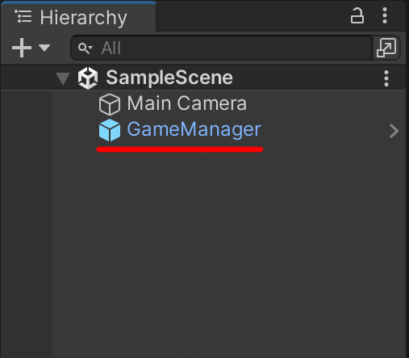

# U-Singleton
## 소개
  
싱글턴 패턴에 대하여 자동 기능이 탑재된 패키지입니다.

## 문서
전체적인 문서는 [여기](https://nk-studio.github.io/USingleton/manual/index.html)를 클릭하여 확인해주세요.

## 설치
### Git UPM
U-Singleton 패키지를 설치하려면 다음 단계가 필요합니다.
1. Git이 설치되어 있는지 확인하십시오.
2. Package Manager를 오픈합니다.
3. +버튼을 클릭하고, Add package from git URL을 클릭합니다.
4. `https://github.com/NK-Studio/USingleton.git#UPM` 를 입력하고 추가 버튼을 클릭하세요.
   
### Unity Package
[Releases](https://github.com/NK-Studio/USingleton/releases)에서 최신 버전의 패키지를 다운로드 받아 설치합니다.
## 사용법

### 싱글턴 객체 만들기
```csharp
using UnityEngine;

public class GameManager : MonoBehaviour
{

}
```
싱글턴 또는 매니저로 만들고 싶은 MonoBehaviour 클래스를 작성합니다.  
```csharp
using UnityEngine;
using USingleton.AutoSingleton;

[Singleton("GameManager")]
public class GameManager : MonoBehaviour
{

}
``` 
다음 내용을 추가 작성합니다.
### 프리팹 생성하기

Tools -> USingleton -> Refresh을 클릭합니다.

  
리소스 폴더에 자동으로 프리팹이 생성됩니다.  
(프리팹 이름은 Singleton 어트리뷰트에 부여한 이름과 동일합니다.)

### 접근 하기
```csharp
using UnityEngine;
using USingleton;

public class TestCode : MonoBehaviour
{
    private void Start()
    {
        Singleton.Instance<GameManager>().HP = 100;
    }
}
```

다음과 같이 작성하여 접근할 수 있습니다.

### 주의
> [!WARNING]
> **Auto Singleton은** DontDestroyOnLoad를 재정의할 수 없으며, 컨셉 자체가 **씬이 변경되어도 파괴되지 않는 것**입니다.
> 만약, **DontDestroyOnLoad를 재정의하여 씬이 변경될 때 파괴되도록 하고 싶다면 <u>Self Singleton</u>을 사용하는 것을 추천**합니다.
