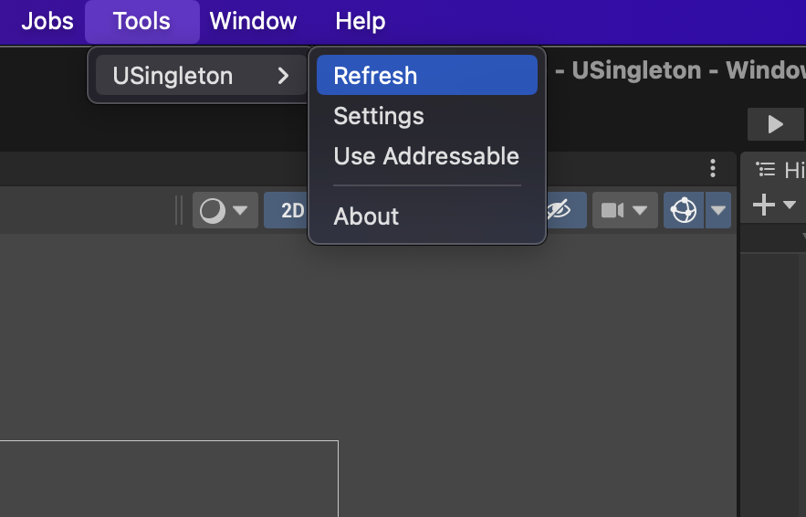

# Addressable Asset System 지원
이 라이브러리는 Resources 폴더에 의존하고 있습니다.  
만약, Resources 폴더 사용하는 것에 부담이 있다면, Addressable Asset System을 사용할 수 있습니다.

> [!CAUTION]
> 이 기능은 Auto Singleton에만 지원됩니다.

---
## Addressable Asset System 기능 활성화하기
  
Window -> Package Manager에서 Addressable Asset System을 설치합니다.  

    
유니티 상단에 Tools -> USingleton -> Settings를 클릭한 다음, <u>**Use Addressable 옵션을 체크**</u>합니다.

## 코드 수정하기
[!code-csharp]

Singleton Attribute의 **두번째 인자에 true를 지정**합니다.

## 프리팹 생성하기

Tools -> USingleton -> Refresh을 클릭합니다.

  
Manager 폴더에 자동으로 프리팹이 생성됩니다.  
(프리팹 이름과 어드레서블 에셋 주소는 Singleton 어트리뷰트에 부여한 이름과 동일합니다.)

> [!WARNING]
> 기존에 Resources 폴더에 생성된 프리팹이 있다면, **삭제**하고 **다시 생성하는 것을 권장**합니다.

## 접근 하기
[!code-csharp]

다음과 같이 작성하여 접근할 수 있습니다.

## 주의
> [!WARNING]
> Addressable Asset System 지원은 현재 **실험적인 기능**입니다, 지속적인 피드백을 남겨주시면 감사하겠습니다.