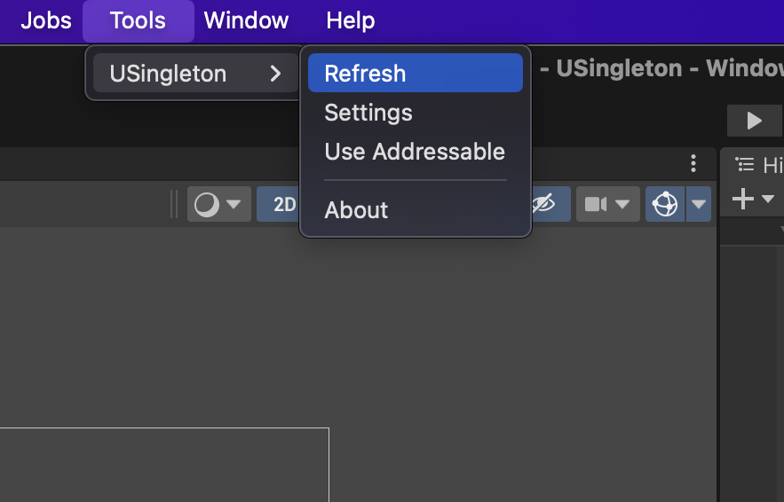
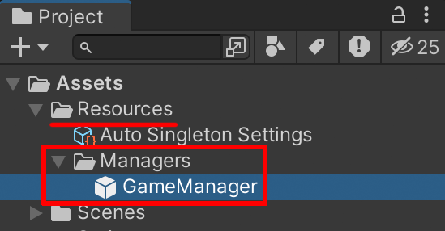

# Auto Singleton
오토 싱글턴은 **어플리케이션이 실행되는 동안 계속 살아있는 싱글턴 객체**를 만들고 싶을 때 사용하는 패턴입니다.  
**USingleton의 메인은 Auto Singleton입니다.**

---
## 싱글턴 객체 만들기
```csharp
using UnityEngine;

public class GameManager : MonoBehaviour
{

}
```
싱글턴 또는 매니저로 만들고 싶은 MonoBehaviour 클래스를 작성합니다.  
[!code-csharp[](../code/Auto Singleton/GameManager.cs?highlight=2,4)]  
다음 내용을 추가 작성합니다.
## 프리팹 생성하기

Tools -> USingleton -> Refresh을 클릭합니다.

  
리소스 폴더에 자동으로 프리팹이 생성됩니다.
(프리팹 이름은 Singleton 어트리뷰트에 부여한 이름과 동일합니다.)

## 접근 하기
[!code-csharp[](../code/TestCode.cs?highlight=2,8)]

다음과 같이 작성하여 접근할 수 있습니다.

## 주의
> [!WARNING]
> **Auto Singleton은** DontDestroyOnLoad를 재정의할 수 없으며, 컨셉 자체가 **씬이 변경되어도 파괴되지 않는 것**입니다.
> 만약, **DontDestroyOnLoad를 재정의하여 씬이 변경될 때 파괴되도록 하고 싶다면 <u>Self Singleton</u>을 사용하는 것을 추천**합니다.