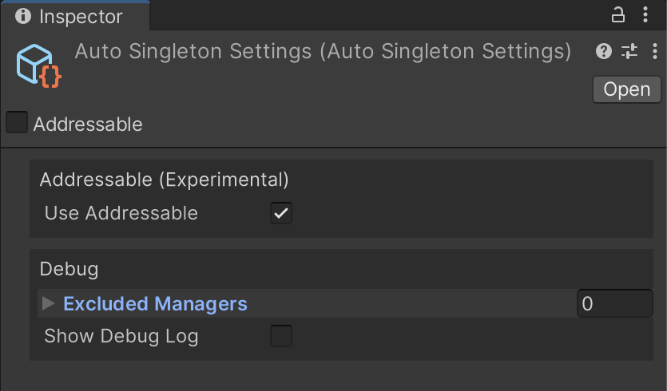
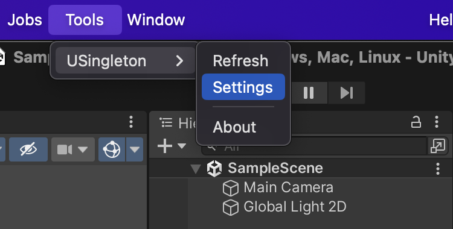

# 설정 파일

| 항목                | 설명                                                                   |
|-------------------|----------------------------------------------------------------------|
| Use Addressable   | Addressable Asset System 방식을 활성화합니다. (이 옵션은 Addressable 패키지를 요구합니다.) |
| Excluded Managers | 자동으로 생성되는 싱글턴 타입을 필터링 합니다. (디버그 용도)                                  |
| Show Debug Log    | 싱글턴 객체가 생성될 때 콘솔창에 로그를 출력합니다.                                        |

USingleton 설정 파일은 다음과 같습니다.

  
설정 파일은 다음과 같은 경로를 통해 오픈할 수 있습니다.